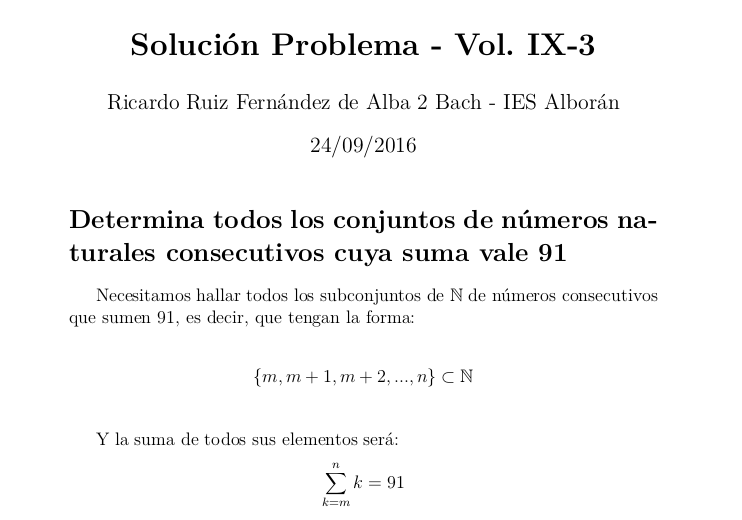

# Concurso de problemas Vol. 9-3

Solución ganadora del problema publicado en el Vol. 9-3 del [Boletín Matemático de la UAL]("http://boletinmatematico.ual.es/Boletin_de_la_Titulacion_de_Matematicas_de_la_UAL/Bienvenida.html")
> "Determina todos los conjuntos de números naturales consecutivos cuya suma vale 91"

Este repositorio contiene:

* Un pequeño [programa](concurso.py) en Python que resuelve el problema.
* El archivo *LaTeX* de la [Solución](solucion.tex)
* Compilado en [Pdf](solucion.pdf)
        [](solucion.pdf)

## Funcionamiento del programa


```shell
$ python concurso.py 91

Los siguientes subconjuntos en N de numeros consecutivos suman 91
{1, ..., 13} => 91
{10, ..., 16} => 91
{45, ..., 46} => 91

```
